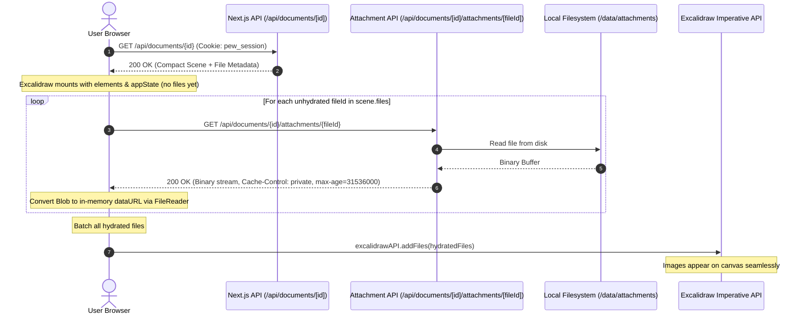
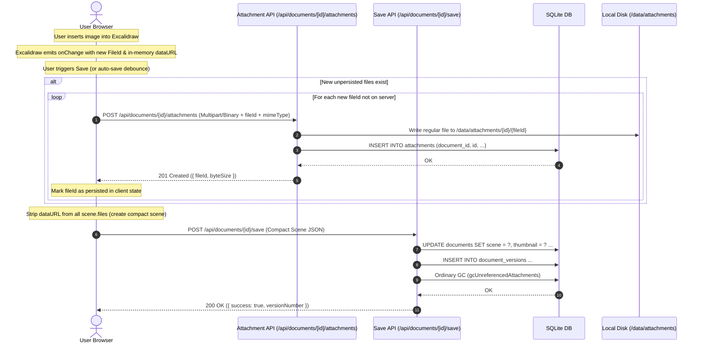

# Direct Binary Attachment Transfer Architecture Design

**Date:** 2026-08-27
**Status:** Draft - pending user review
**Scope:** Document & Share Attachment Transfer, Compact Scene Wire Format, Client Memory Hydration, Failure Resilience, Two-Tier Garbage Collection, and Admin Storage Maintenance

---

## 1. Executive Summary & Problem Statement

In the original implementation, image attachments were extracted server-side during scene saves by parsing embedded `dataURL` (Base64) strings from the JSON payload. While functional, transmitting multi-megabyte Base64 payloads over JSON REST endpoints incurs significant memory overhead, increases request latency, and inflates database and JSON serialization buffers.

This specification defines the **Direct Binary Attachment Transfer** architecture:
1. **Compact Wire Transport:** All document and share JSON responses transmit only compact scene structures where `BinaryFiles` entries contain attachment metadata without `dataURL` / Base64 strings.
2. **Client-Side Binary Fetch & In-Memory Hydration:** The browser requests raw image binaries via authenticated, document-scoped endpoints (or token-validated share endpoints), constructs ephemeral `dataURL` strings in browser runtime memory only, and registers them into Excalidraw via its imperative API (`excalidrawAPI.addFiles`).
3. **Pre-Upload Binary Transfer on Save:** When a user inserts an image, the client uploads the raw binary payload directly to the server before saving the scene. The scene JSON is saved only after all referenced binary attachments have been successfully persisted.
4. **Two-Tier Garbage Collection & Lifecycle Safety:**
   - **Tier 1 (Ordinary Post-Save GC):** Immediate document-scoped garbage collection following a successful scene save, purging attachments not referenced in the active scene or surviving version snapshots.
   - **Tier 2 (Admin Storage Maintenance & Unreferenced Row Cleanup):** Explicit administrator scan and cleanup for abandoned attachment DB rows unreferenced across all scenes and snapshots, protected by a mandatory 24-hour grace period.
5. **Isolated Server-Side Hydration:** Server-side scene hydration with Base64 is strictly restricted to standalone image/canvas export operations (e.g., rendering raster PNG or SVG exports on the server).

---

## 2. Core Architectural Principles & Invariants

1. **Zero Base64 over Document JSON APIs:** JSON endpoints (`/api/documents/[id]`, `/api/documents/[id]/save`, `/api/share/[token]`, `/api/documents/[id]/versions`) must never transmit or accept Base64 `dataURL` strings in steady-state operations.
2. **Excalidraw BinaryFiles Contract:** Excalidraw's internal renderer requires `dataURL` formatted strings in `BinaryFileData`. Direct HTTP URLs cannot be placed in `BinaryFileData.dataURL`. Therefore, binary payloads are fetched as `Blob`s and converted into `dataURL` objects **only within the browser's JavaScript execution context**.
3. **Fail-Closed Persistence Invariant:** A compact scene referencing a new `fileId` **must never** be saved to the database unless the server has already acknowledged persistent disk and database storage of that binary attachment.
4. **Strict Authorization & Scoping:** Attachment endpoints must verify user permissions scoped directly to the document ID or validate an active, non-expired public share token.
5. **Document-Scoped Identity:** All attachment records and lookups are scoped by `(document_id, id)`.
6. **Grace-Period Protected Admin Cleanup:** Unreferenced attachment DB rows resulting from aborted sessions or abandoned uploads are never deleted during normal client operations; they are safely swept by administrator action only after a 24-hour grace period.

---

## 3. Data Model & Database Schema

### 3.1 Compact Scene Wire Format

On the wire and in SQLite (`documents.scene` and `document_versions.scene`), `files` contains lightweight metadata records:

```typescript
export interface CompactBinaryFile {
  id: string;        // Excalidraw FileId (e.g. "a1b2c3d4...")
  mimeType: string;  // e.g. "image/png", "image/jpeg", "image/svg+xml"
  created: number;   // Unix timestamp in ms
  byteSize?: number; // File size in bytes
  // dataURL is deliberately omitted / undefined on the wire
}

export interface CompactScene {
  type: "excalidraw";
  version: 2;
  source?: string;
  elements: readonly ExcalidrawElement[];
  appState: Partial<AppState>;
  files: Record<string, CompactBinaryFile>;
}
```

### 3.2 In-Memory Client Binary File (Hydrated)

Within client browser memory only:

```typescript
export interface HydratedBinaryFileData {
  id: string;
  mimeType: string;
  dataURL: string; // "data:image/png;base64,..." constructed in browser memory
  created: number;
}
```

### 3.3 Attachment Database Schema

The database maintains document-scoped attachment metadata linking document records to local disk paths. The composite primary key is `(document_id, id)`:

```sql
CREATE TABLE IF NOT EXISTS attachments (
  id          TEXT NOT NULL,                                     -- Excalidraw FileId (e.g. "file_abc123")
  document_id TEXT NOT NULL REFERENCES documents(id) ON DELETE CASCADE,
  file_name   TEXT NOT NULL,                                     -- Original or sanitized file name
  file_size   INTEGER NOT NULL,                                  -- Byte length on disk
  mime_type   TEXT NOT NULL,                                     -- MIME type (e.g. "image/png")
  file_path   TEXT NOT NULL,                                     -- Relative path under data/ (e.g. "attachments/<docId>/<fileId>")
  sha256      TEXT,                                              -- Content digest
  created_at  TEXT NOT NULL,                                     -- ISO 8601 timestamp
  PRIMARY KEY (document_id, id)
);

CREATE INDEX IF NOT EXISTS idx_attachments_doc ON attachments(document_id);
```

---

## 4. Read & Load Lifecycle

### 4.1 Authenticated Editor Load Flow



#### Step-by-Step Details:
1. **Initial Mount:** The client receives the document payload containing the compact scene. The `ExcalidrawCanvas` component mounts immediately with the scene's `elements` and `appState`, providing instant visual layout.
2. **Binary Resolution:** The client inspects `scene.files` and checks its local memory cache for each `fileId`.
3. **Parallel Fetching:** For missing files, the client concurrently fetches raw binaries from `/api/documents/[id]/attachments/[fileId]` (bounded to 4 concurrent requests).
4. **Local Conversion:** The binary response is read as a `Blob` and converted into an in-memory Base64 data URL using `FileReader.readAsDataURL()`.
5. **Imperative Injection:** Once resolved, files are batched and injected into Excalidraw via `excalidrawAPI.addFiles(newFiles)`.

### 4.2 Public Share Viewer Load Flow

1. The viewer requests `/api/share/[token]`. The server validates token validity, expiration, and document active status.
2. The server returns the compact scene and document metadata.
3. The client fetches individual binary attachments from `/api/share/[token]/attachments/[fileId]`.
4. The server validates that:
   - The share token is valid and active.
   - The requested `fileId` is associated with the document linked to that share token.
5. The browser converts incoming blobs to in-memory `dataURL`s and calls `excalidrawAPI.addFiles()`.

---

## 5. Save & Creation Lifecycle

### 5.1 Save Protocol Sequence



### 5.2 Client-Side Diffing & Upload Strategy

1. **Known File Registry:** The client maintains a `Set<string>` of `persistedFileIds` that have been successfully saved on the server.
2. **Dirty Detection:** On save, the client filters `Object.entries(currentScene.files)` for any entry where `fileId` is not present in `persistedFileIds`.
3. **Binary Extraction:** For new files, the client extracts the binary data from Excalidraw's in-memory `dataURL` (via `fetch(dataURL).then(r => r.blob())` or `atob` byte conversion).
4. **Direct Multipart/Binary Upload:** The client sends a `POST` request to `/api/documents/[id]/attachments` with `FormData` containing the file blob and metadata (`fileId`, `mimeType`).
5. **Atomic Scene Submission:** Only when **all** pending attachment uploads return `200/201 OK`, the client constructs the `CompactScene` payload (omitting `dataURL` fields) and posts it to `/api/documents/[id]/save`.

---

## 6. Server-Side Export Architecture

Server-side export (`/api/documents/[id]/export`) is the sole subsystem that performs server-side hydration:

1. **Request:** User requests document export as `.excalidraw` standalone file or server-rendered PNG/SVG.
2. **Hydration Engine:**
   - Server fetches the `CompactScene` from SQLite.
   - For each `fileId` in `scene.files`, the server reads the corresponding physical file from `data/attachments/[id]/[fileId]`.
   - The server encodes the file bytes into `dataURL` format (`data:${mime};base64,...`).
   - The hydrated scene is passed to `@excalidraw/utils` export functions or returned as a standalone portable `.excalidraw` file containing embedded Base64.

---

## 7. Two-Tier Garbage Collection & Lifecycle Safety

### 7.1 Tier 1: Immediate Post-Save GC (`gcUnreferencedAttachments`)

When a scene save completes successfully on `/api/documents/[id]/save`, the server executes ordinary document-scoped garbage collection:
1. Collects all `fileId` references across:
   - The active document scene (`documents.scene`).
   - All preserved historical snapshots for this document (`document_versions.scene`).
2. Compares referenced `fileId`s against `attachments` table rows where `document_id = ?`.
3. Any attachment row in this document not referenced in the active scene or surviving version snapshots is immediately deleted along with its disk file.
4. Preserves snapshot retention invariants: attachments referenced in any valid version history snapshot are strictly retained.

### 7.2 Tier 2: Administrator Storage Maintenance & Unreferenced Row Cleanup

If a user uploads attachments via `/api/documents/[id]/attachments` (creating DB rows and disk files) but disconnects, navigates away, or encounters a client failure before `/api/documents/[id]/save` completes, those attachment rows are not swept by Tier 1 GC because no save occurred.

To address this without risking race conditions against active editing sessions, the Administrator Storage Maintenance subsystem provides dedicated scanning and cleanup:

#### Scan Categories & Distinctions:
1. **Physical Orphan Files (`orphans`):**
   - Disk files under `data/attachments/` or `data/thumbnails/` that have **no corresponding row** in the `attachments` or `thumbnails` database tables.
2. **Missing Referenced Files (`missingFiles`):**
   - Database rows in `attachments` or `thumbnails` where the physical file is absent from disk. (DB rows are strictly preserved for historical integrity).
3. **Unreferenced Attachment Records (`unreferencedAttachments`):**
   - Database rows in `attachments` whose `id` is not present in the owning document's active scene (`documents.scene`) nor in any surviving snapshot (`document_versions.scene`).
   - **Grace Period Invariant:** An unreferenced attachment record is only flagged as an eligible cleanup candidate if `strftime('%s','now') - strftime('%s', created_at) >= 86400` (i.e., created at least 24 hours ago). This ensures active in-progress uploads or concurrent editing sessions are never prematurely purged.

#### Admin Cleanup Protocol (`cleanUnreferencedAttachments`):
1. **Explicit Confirmation:** Requires `{ action: "cleanup-unreferenced", confirm: true }`.
2. **Live Rescan:** Performs an immediate pre-cleanup rescan enforcing the 24-hour grace period filter.
3. **Safe Deletion:**
   - Deletes the `attachments` table row.
   - Deletes ONLY the contained regular file on disk (`resolveAttachmentFilesystem(row)`).
   - **Never** deletes rows whose files are missing (preserves missing-file reporting).
   - **Never** follows or deletes symlinks (verifies `!stat.isSymbolicLink() && stat.isFile()`).
   - Cleans up empty parent directories under `data/attachments/[id]/`.

---

## 8. Admin UI & Metric Specification

The Storage Maintenance dashboard (`/dashboard` -> Storage & Maintenance) displays the following metrics and panels:

### Metric Cards:
- **Database File:** SQLite size, page count, page size.
- **WAL / SHM:** Write-ahead log and shared memory byte sizes.
- **Attachments:** Total physical disk file count and byte size.
- **Thumbnails:** Total preview images count and byte size.
- **SQLite Freelist:** Reclaimable pages and byte total.
- **Unreferenced Attachments:** Count and total bytes of attachment DB rows unreferenced by any scene/snapshot past the 24-hour grace period.

### Warning & Action Panels:
- **Missing Referenced Files Banner:** Displays any DB rows whose files are missing from disk.
- **Orphan Physical Files Table:** Lists unreferenced disk files with a **[Clean Up Orphan Files]** action button.
- **Unreferenced Attachment Records Table:** Lists abandoned attachment rows older than 24 hours with a **[Purge Unreferenced Attachments]** action button.
- **SQLite VACUUM Action:** Compaction button with explicit blocking operation warning modal.

---

## 9. Security & Authorization Matrix

| Endpoint | Method | Required Auth / Role | Scoping & Containment Rules |
| :--- | :--- | :--- | :--- |
| `/api/documents/[id]/attachments` | `POST` | Authenticated User (Owner / Editor) | Path containment within `data/attachments/[id]/`; fileId sanitized (alphanumeric/hyphens only). |
| `/api/documents/[id]/attachments/[fileId]` | `GET` | Authenticated User (Owner / Editor / Viewer) | Verifies membership on `[id]`; forbids symlinks; enforces regular file read. |
| `/api/share/[token]/attachments/[fileId]` | `GET` | Public (Valid Share Token) | Token must be active and non-expired; `[fileId]` must belong to token's `document_id`. |
| `/api/documents/[id]/save` | `POST` | Authenticated User (Owner / Editor) | Bounded JSON body (< 25 MB); verifies user write permissions; triggers Tier 1 GC. |
| `/api/admin/storage` | `GET` / `POST` | Admin Only (`role === 'ADMIN'`) | Returns storage metrics, orphan files, missing files, and unreferenced attachment records; requires `confirm: true` for cleanups. |

---

## 10. Required Test Cases & Verification Suite

1. **Direct Upload & Persistence:**
   - Verify `POST /api/documents/[id]/attachments` accepts multipart binary, writes regular file under `data/attachments/[id]/[fileId]`, and creates attachment row with `(document_id, id)`.
   - Verify invalid `docId` or path-traversal attempts in `fileId` return 400.
2. **Compact Scene Serialization:**
   - Verify `/api/documents/[id]` and `/api/share/[token]` return compact scenes with no `dataURL` fields in `files`.
3. **Tier 1 Ordinary Post-Save GC:**
   - Verify attachments removed from an active scene are retained if present in an existing version snapshot.
   - Verify attachments removed from both active scene and all version snapshots are immediately deleted on save.
4. **Tier 2 Admin Unreferenced Row Scan & Grace Period:**
   - Insert an unreferenced attachment row with `created_at` = 1 hour ago -> verify scan reports 0 eligible candidates (within grace period).
   - Insert an unreferenced attachment row with `created_at` = 25 hours ago -> verify scan reports 1 eligible candidate.
   - Run confirmed cleanup -> verify row and physical file are safely deleted.
5. **Safety Invariants:**
   - Verify cleanup never deletes DB rows for missing files.
   - Verify cleanup never follows or deletes symbolic links.
   - Verify unconfirmed POST requests return 400.
